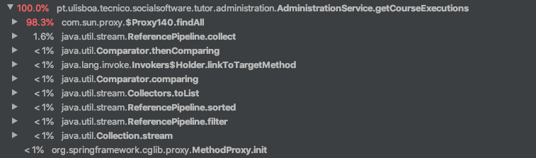
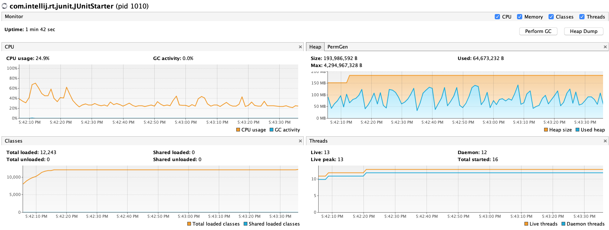
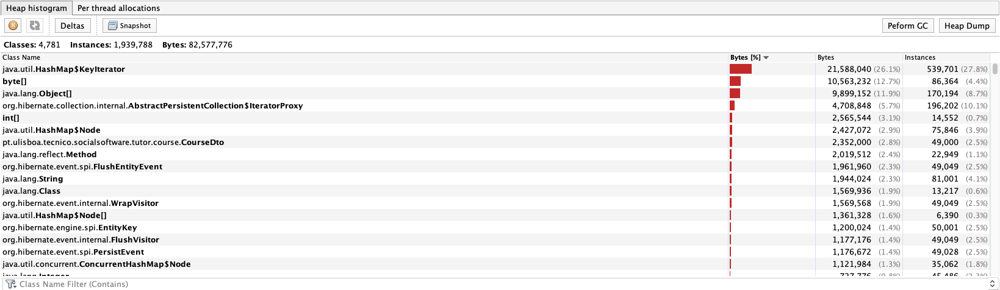

# ES20 P2 submission, Group 33

## Feature PPA

### Subgroup
 - Nome, istID, githubID
   + Issues assigned: [#1](https://github.com), [#3](https://github.com)
 - Nome, istID, githubID
   + Issues assigned: [#2](https://github.com), [#4](https://github.com)
 
### Pull requests associated with this feature

The list of pull requests associated with this feature is:

 - [PR #000](https://github.com)
 - [PR #001](https://github.com)
 - [PR #002](https://github.com)

### Web services definition

#### Controllers
 - [Controller0](https://github.com)
 - [Controller1](https://github.com)

### Feature testing

Each subgroup member defined one reading test and one writing test. The direct links to these are:

 - [ReadingTestJMeter](https://github.com)
 - [WritingTestJMeter](https://github.com)

#### Screenshots of Results Trees and DB cleanup

### Load testing

Each subgroup member defined one reading test and one writing test. The direct links to these are:

 - [ReadingTestJMeter](https://github.com)
 - [WritingTestJMeter](https://github.com)

#### Screenshots of Summary Reports and DB cleanup

### Service profiling

We used the [Async Profiler](https://www.jetbrains.com/help/idea/async-profiler.html).

#### Screenshots of summary reports

#### Discussion of findings

**TODO**: include here a short description of findings (max. 3 sentences). If
you found opportunities for optimization, you can use more than 3 sentences to
describe what you found and how you optimized your code.

---

## Feature DDP

### Subgroup
 - Nome, istID, githubID
   + Issues assigned: [#1](https://github.com), [#3](https://github.com)
 - Nome, istID, githubID
   + Issues assigned: [#2](https://github.com), [#4](https://github.com)
 
### Pull requests associated with this feature

The list of pull requests associated with this feature is:

 - [PR #000](https://github.com)
 - [PR #001](https://github.com)
 - [PR #002](https://github.com)

### Web services definition

#### Controllers
 - [Controller0](https://github.com)
 - [Controller1](https://github.com)

### Feature testing

Each subgroup member defined one reading test and one writing test. The direct links to these are:

 - [ReadingTestJMeter](https://github.com)
 - [WritingTestJMeter](https://github.com)

#### Screenshots of Results Trees and DB cleanup

### Load testing

Each subgroup member defined one reading test and one writing test. The direct links to these are:

 - [ReadingTestJMeter](https://github.com)
 - [WritingTestJMeter](https://github.com)

#### Screenshots of Summary Reports and DB cleanup

### Service profiling

We used the [Async Profiler](https://www.jetbrains.com/help/idea/async-profiler.html).

#### Screenshots of summary reports

#### Discussion of findings

**TODO**: include here a short description of findings (max. 3 sentences). If
you found opportunities for optimization, you can use more than 3 sentences to
describe what you found and how you optimized your code.

---

## Feature TDP

### Subgroup
 - Francisco Lopes, ist188078, Aegiel
   + Issues assigned: [#1](https://github.com), [#3](https://github.com)
 - Manuel Goulão, ist191049, mgoulao
   + Issues assigned: [#72](https://github.com/tecnico-softeng/es20tg_33-project/issues/72), [#75](https://github.com/tecnico-softeng/es20tg_33-project/issues/75), [#76](https://github.com/tecnico-softeng/es20tg_33-project/issues/76), [#78](https://github.com/tecnico-softeng/es20tg_33-project/issues/78), [#79](https://github.com/tecnico-softeng/es20tg_33-project/issues/79), [#80](https://github.com/tecnico-softeng/es20tg_33-project/issues/80), [#81](https://github.com/tecnico-softeng/es20tg_33-project/issues/81), [#87](https://github.com/tecnico-softeng/es20tg_33-project/issues/87)
 
### Pull requests associated with this feature

The list of pull requests associated with this feature is:

 - [PR #076](https://github.com/tecnico-softeng/es20tg_33-project/pull/77)
 - [PR #086](https://github.com/tecnico-softeng/es20tg_33-project/pull/86)
 - [PR #088](https://github.com/tecnico-softeng/es20tg_33-project/pull/88)

### Web services definition

#### Controllers
 - [GET Tourneys](https://github.com/tecnico-softeng/es20tg_33-project/blob/8225e560715b28e1deecceb22b3b2f89e10aa3d8/backend/src/main/java/pt/ulisboa/tecnico/socialsoftware/tutor/tourney/TourneyController.java#L20)
 - [GET Open Tourneys](https://github.com/tecnico-softeng/es20tg_33-project/blob/8225e560715b28e1deecceb22b3b2f89e10aa3d8/backend/src/main/java/pt/ulisboa/tecnico/socialsoftware/tutor/tourney/TourneyController.java#L31)
 - [PUT Enroll Student in Tourney](https://github.com/tecnico-softeng/es20tg_33-project/blob/8225e560715b28e1deecceb22b3b2f89e10aa3d8/backend/src/main/java/pt/ulisboa/tecnico/socialsoftware/tutor/tourney/TourneyController.java#L38)
 - [PUT Cancel Tourney](https://github.com/tecnico-softeng/es20tg_33-project/blob/8225e560715b28e1deecceb22b3b2f89e10aa3d8/backend/src/main/java/pt/ulisboa/tecnico/socialsoftware/tutor/tourney/TourneyController.java#L45)

### Feature testing

Each subgroup member defined one at least one writing test and one defined one reading test. The direct links to these are:

 - [Create Tourney](https://github.com/tecnico-softeng/es20tg_33-project/blob/develop/backend/jmeter/tourney/WSCreateTourneyTest.jmx)
 - [Cancel Torney](https://github.com/tecnico-softeng/es20tg_33-project/blob/develop/backend/jmeter/tourney/WSCancelTourneyTest.jmx)
 - [Enroll Student in Tourney](https://github.com/tecnico-softeng/es20tg_33-project/blob/develop/backend/jmeter/tourney/WSStudentEnrollsIntoTourneyTest.jmx)
 - [Get Open Tourneys](https://github.com/tecnico-softeng/es20tg_33-project/blob/develop/backend/jmeter/tourney/WSGetOpenTourneysTest.jmx)

#### Screenshots of Results Trees and DB cleanup

### Load testing

Each subgroup member defined one at least one writing test and one defined one reading test. The direct links to these are:

 - [Create Tourney](https://github.com/tecnico-softeng/es20tg_33-project/blob/develop/backend/jmeter/tourney/WSCreateTourneyLoadTest.jmx)
 - [Cancel Torney](https://github.com/tecnico-softeng/es20tg_33-project/blob/develop/backend/jmeter/tourney/WSCancelTourneyLoadTest.jmx)
 - [Enroll Student in Tourney](https://github.com/tecnico-softeng/es20tg_33-project/blob/develop/backend/jmeter/tourney/WSStudentEnrollsIntoTourneyLoadTest.jmx)
 - [Get Open Tourneys](https://github.com/tecnico-softeng/es20tg_33-project/blob/develop/backend/jmeter/tourney/WSGetOpenTourneysLoadTest.jmx)

#### Screenshots of Summary Reports and DB cleanup

### Service profiling

We used the [Async Profiler](https://www.jetbrains.com/help/idea/async-profiler.html).

#### Screenshots of summary reports

#### Discussion of findings

**TODO**: include here a short description of findings (max. 3 sentences). If
you found opportunities for optimization, you can use more than 3 sentences to
describe what you found and how you optimized your code.

