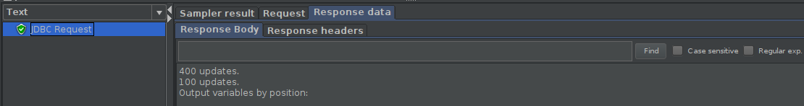
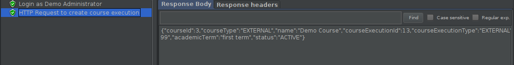
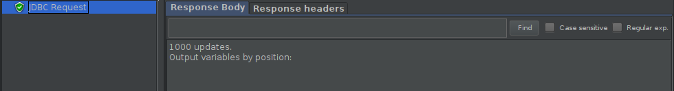
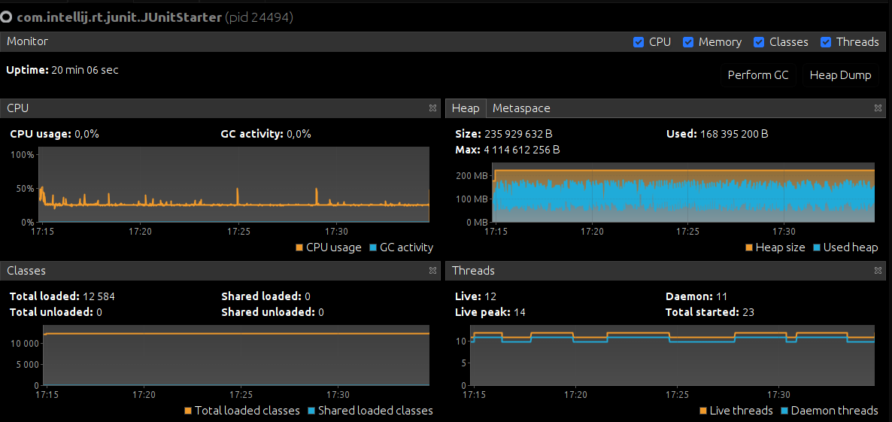
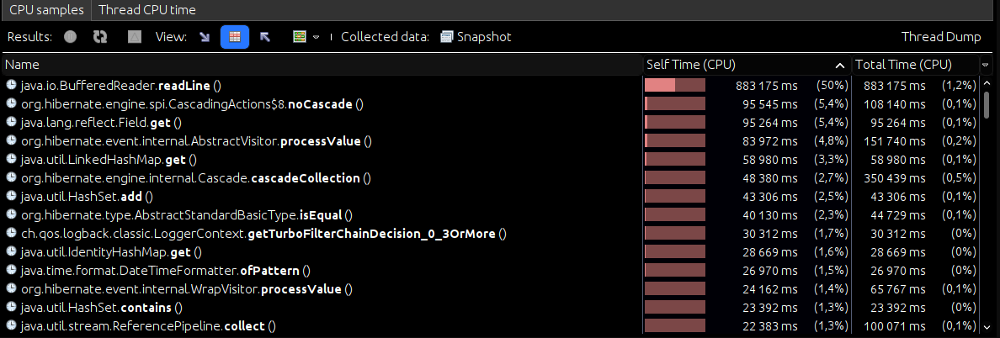

# ES20 P2 submission, Group 33

## Feature PPA

### Subgroup
 - João Martins, ist190616, nodoak33
   + Issues assigned: [#74](https://github.com/tecnico-softeng/es20tg_33-project/issues/74), [#83](https://github.com/tecnico-softeng/es20tg_33-project/issues/83), [#98](https://github.com/tecnico-softeng/es20tg_33-project/issues/98), [#99](https://github.com/tecnico-softeng/es20tg_33-project/issues/99)
 - Xavier Gomes, ist190637, xaviergomes99
   + Issues assigned: [#73](https://github.com/tecnico-softeng/es20tg_33-project/issues/73), [#82](https://github.com/tecnico-softeng/es20tg_33-project/issues/82)
 
### Pull requests associated with this feature

The list of pull requests associated with this feature is:

 - [PR #96](https://github.com/tecnico-softeng/es20tg_33-project/pull/96)
 - [PR #106](https://github.com/tecnico-softeng/es20tg_33-project/pull/106)

### Web services definition

#### Controllers
 - [POST Submit Question](https://github.com/tecnico-softeng/es20tg_33-project/blob/PpA/backend/src/main/java/pt/ulisboa/tecnico/socialsoftware/tutor/question/api/QuestionController.java#L128)
 - [PUT Approve submitted questions](https://github.com/tecnico-softeng/es20tg_33-project/blob/PpA/backend/src/main/java/pt/ulisboa/tecnico/socialsoftware/tutor/question/api/QuestionController.java#L148)
 - [PUT Reject submitted questions](https://github.com/tecnico-softeng/es20tg_33-project/blob/PpA/backend/src/main/java/pt/ulisboa/tecnico/socialsoftware/tutor/question/api/QuestionController.java#L155)
 - [GET Get submitted questions information](https://github.com/tecnico-softeng/es20tg_33-project/blob/PpA/backend/src/main/java/pt/ulisboa/tecnico/socialsoftware/tutor/user/UserController.java#L63)

### Feature testing

Each subgroup member defined one reading test and one writing test. The direct links to these are:

 - [Submit Question](https://github.com/tecnico-softeng/es20tg_33-project/blob/PpA/backend/jmeter/question/WSSubmitQuestionTest.jmx)
 - [Approve/Reject submitted questions](https://github.com/tecnico-softeng/es20tg_33-project/blob/PpA/backend/jmeter/question/WSApproveRejectQuestionTest.jmx)
 - [Get submitted questions information](https://github.com/tecnico-softeng/es20tg_33-project/blob/PpA/backend/jmeter/question/WSGetQuestionStatusTest.jmx)

#### Screenshots of Results Trees and DB cleanup

##### Submit Question

##### Approve/Reject submitted questions

##### Get submitted questions information

### Load testing

Each subgroup member defined one reading test and one writing test. The direct links to these are:

 - [Submit Question](https://github.com/tecnico-softeng/es20tg_33-project/blob/PpA/backend/jmeter/question/WSSubmitQuestionLoadTest.jmx)
 - [Approve/Reject submitted questions](https://github.com/tecnico-softeng/es20tg_33-project/blob/PpA/backend/jmeter/question/WSApproveRejectQuestionLoadTest.jmx)
 - [Get submitted questions information](https://github.com/tecnico-softeng/es20tg_33-project/blob/PpA/backend/jmeter/question/WSGetQuestionStatusLoadTest.jmx)

#### Screenshots of Summary Reports and DB cleanup

##### Submit Question

##### Approve/Reject submitted questions

##### Get submitted questions information

### Service profiling

We used the [Async Profiler](https://www.jetbrains.com/help/idea/async-profiler.html).

#### Screenshots of summary reports

##### Submit Question

##### Approve/Reject submitted questions

##### Get submitted questions information

#### Discussion of findings

Functions like finById, findByUsername and findAll (Repository functions) are very demanding and should be avoided whenever possible.

---

## Feature DDP

### Subgroup
 - Rodrigo Costa, 87702, rcosta1997
   + Issues assigned: [#90](https://github.com/tecnico-softeng/es20tg_33-project/issues/90), [#91](https://github.com/tecnico-softeng/es20tg_33-project/issues/91), [#92](https://github.com/tecnico-softeng/es20tg_33-project/issues/92)
 - Ricardo Caetano, 87699, OcarinaRedcoat
   + Issues assigned: [#93](https://github.com/tecnico-softeng/es20tg_33-project/issues/93), [#100](https://github.com/tecnico-softeng/es20tg_33-project/issues/100), [#101](https://github.com/tecnico-softeng/es20tg_33-project/issues/101)
 
### Pull requests associated with this feature

The list of pull requests associated with this feature is:

 - [PR #000](https://github.com)
 - [PR #001](https://github.com)
 - [PR #002](https://github.com)

### Web services definition

#### Controllers
 - [POST Create Discussion](https://github.com/tecnico-softeng/es20tg_33-project/blob/499a46acd261a6941e134059f4842158f22d2616/backend/src/main/java/pt/ulisboa/tecnico/socialsoftware/tutor/answer/api/DiscussionController.java#L27)
 - [POST Submit Message](https://github.com/tecnico-softeng/es20tg_33-project/blob/499a46acd261a6941e134059f4842158f22d2616/backend/src/main/java/pt/ulisboa/tecnico/socialsoftware/tutor/answer/api/DiscussionController.java#L33)
 - [GET Visualize Teacher Messages](https://github.com/tecnico-softeng/es20tg_33-project/blob/499a46acd261a6941e134059f4842158f22d2616/backend/src/main/java/pt/ulisboa/tecnico/socialsoftware/tutor/answer/api/DiscussionController.java#L41)

### Feature testing

Each subgroup member defined one reading test and one writing test. The direct links to these are:

 - [Submit Student Message](https://github.com/tecnico-softeng/es20tg_33-project/blob/DdP/backend/jmeter/discussion/WSSubmitStudentMessageTest.jmx)
 - [Submit Student Message](https://github.com/tecnico-softeng/es20tg_33-project/blob/DdP/backend/jmeter/discussion/WSSubmitTeacherMessageTest.jmx)
 - [Get Teacher Messages](https://github.com/tecnico-softeng/es20tg_33-project/blob/DdP/backend/jmeter/discussion/WSGetDiscussionTest.jmx)

#### Screenshots of Results Trees and DB cleanup

### Load testing

Each subgroup member defined one reading test and one writing test. The direct links to these are:

 - [Submit Student Message](https://github.com/tecnico-softeng/es20tg_33-project/blob/DdP/backend/jmeter/discussion/WSSubmitStudentMessageLoadTest.jmx)
 - [Submit Student Message](https://github.com/tecnico-softeng/es20tg_33-project/blob/DdP/backend/jmeter/discussion/WSSubmitTeacherMessageLoadTest.jmx)
 - [Get Teacher Messages](https://github.com/tecnico-softeng/es20tg_33-project/blob/DdP/backend/jmeter/discussion/WSGetDiscussionLoadTest.jmx)

#### Screenshots of Summary Reports and DB cleanup

### Service profiling

We used the [Async Profiler](https://www.jetbrains.com/help/idea/async-profiler.html).

#### Screenshots of summary reports

#### Discussion of findings

**TODO**: include here a short description of findings (max. 3 sentences). If
you found opportunities for optimization, you can use more than 3 sentences to
describe what you found and how you optimized your code.

---

## Feature TDP

### Subgroup
 - Francisco Lopes, ist188078, Aegiel
   + Issues assigned: [#69](https://github.com/tecnico-softeng/es20tg_33-project/issues/69), [#70](https://github.com/tecnico-softeng/es20tg_33-project/issues/70), [#84](https://github.com/tecnico-softeng/es20tg_33-project/issues/84), [#85](https://github.com/tecnico-softeng/es20tg_33-project/issues/85), [#94](https://github.com/tecnico-softeng/es20tg_33-project/issues/94), [#94](https://github.com/tecnico-softeng/es20tg_33-project/issues/94)
 - Manuel Goulão, ist191049, mgoulao
   + Issues assigned: [#72](https://github.com/tecnico-softeng/es20tg_33-project/issues/72), [#75](https://github.com/tecnico-softeng/es20tg_33-project/issues/75), [#76](https://github.com/tecnico-softeng/es20tg_33-project/issues/76), [#78](https://github.com/tecnico-softeng/es20tg_33-project/issues/78), [#79](https://github.com/tecnico-softeng/es20tg_33-project/issues/79), [#80](https://github.com/tecnico-softeng/es20tg_33-project/issues/80), [#81](https://github.com/tecnico-softeng/es20tg_33-project/issues/81), [#87](https://github.com/tecnico-softeng/es20tg_33-project/issues/87)
 
### Pull requests associated with this feature

The list of pull requests associated with this feature is:

 - [PR #076](https://github.com/tecnico-softeng/es20tg_33-project/pull/77)
 - [PR #086](https://github.com/tecnico-softeng/es20tg_33-project/pull/86)
 - [PR #088](https://github.com/tecnico-softeng/es20tg_33-project/pull/88)
 - [PR #089](https://github.com/tecnico-softeng/es20tg_33-project/pull/89)
 - [PR #103](https://github.com/tecnico-softeng/es20tg_33-project/pull/103)

### Web services definition

#### Controllers
 - [GET Tourneys](https://github.com/tecnico-softeng/es20tg_33-project/blob/8225e560715b28e1deecceb22b3b2f89e10aa3d8/backend/src/main/java/pt/ulisboa/tecnico/socialsoftware/tutor/tourney/TourneyController.java#L20)
 - [GET Open Tourneys](https://github.com/tecnico-softeng/es20tg_33-project/blob/8225e560715b28e1deecceb22b3b2f89e10aa3d8/backend/src/main/java/pt/ulisboa/tecnico/socialsoftware/tutor/tourney/TourneyController.java#L31)
 - [PUT Student Enrolls Into Tourney](https://github.com/tecnico-softeng/es20tg_33-project/blob/8225e560715b28e1deecceb22b3b2f89e10aa3d8/backend/src/main/java/pt/ulisboa/tecnico/socialsoftware/tutor/tourney/TourneyController.java#L38)
 - [PUT Cancel Tourney](https://github.com/tecnico-softeng/es20tg_33-project/blob/8225e560715b28e1deecceb22b3b2f89e10aa3d8/backend/src/main/java/pt/ulisboa/tecnico/socialsoftware/tutor/tourney/TourneyController.java#L45)

### Feature testing

Each subgroup member defined at least one writing test and one member defined one reading test. The direct links to these are:

 - [Create Tourney](https://github.com/tecnico-softeng/es20tg_33-project/blob/develop/backend/jmeter/tourney/WSCreateTourneyTest.jmx)
 - [Cancel Torney](https://github.com/tecnico-softeng/es20tg_33-project/blob/develop/backend/jmeter/tourney/WSCancelTourneyTest.jmx)
 - [Student Enrolls Into Tourney](https://github.com/tecnico-softeng/es20tg_33-project/blob/develop/backend/jmeter/tourney/WSStudentEnrollsIntoTourneyTest.jmx)
 - [Get Open Tourneys](https://github.com/tecnico-softeng/es20tg_33-project/blob/develop/backend/jmeter/tourney/WSGetOpenTourneysTest.jmx)

#### Screenshots of Results Trees and DB cleanup

##### CreateTourney

##### GetOpenTourneys

##### StudentEnrollsIntoTourney

##### CancelTourney

### Load testing

Each subgroup member defined at least one writing test and one member defined one reading test. The direct links to these are:

 - [Create Tourney](https://github.com/tecnico-softeng/es20tg_33-project/blob/develop/backend/jmeter/tourney/WSCreateTourneyLoadTest.jmx)
 - [Cancel Torney](https://github.com/tecnico-softeng/es20tg_33-project/blob/develop/backend/jmeter/tourney/WSCancelTourneyLoadTest.jmx)
 - [Student Enrolls Into Tourney](https://github.com/tecnico-softeng/es20tg_33-project/blob/develop/backend/jmeter/tourney/WSStudentEnrollsIntoTourneyLoadTest.jmx)
 - [Get Open Tourneys](https://github.com/tecnico-softeng/es20tg_33-project/blob/develop/backend/jmeter/tourney/WSGetOpenTourneysLoadTest.jmx)

#### Screenshots of Summary Reports and DB cleanup

##### CreateTourney

##### GetOpenTourneys

##### StudentEnrollsIntoTourney

##### CancelTourney

### Service profiling

We used the [Async Profiler](https://www.jetbrains.com/help/idea/async-profiler.html).

#### Screenshots of summary reports

##### CreateTourney

##### GetOpenTourneys

##### StudentEnrollsIntoTourney

##### CancelTourney

#### Discussion of findings
Sorts are very heavy, specially with a lot of elements, so we removed any sort that we found unnecessary.
Repository functions, like findAll, should be avoided as much as possible.
