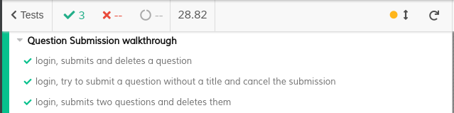
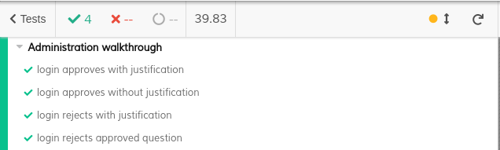

# ES20 P3 submission, Group 33

## Feature PPA

### Subgroup

 - João Martins, ist190616, nodoak33
   + Issues assigned: [#122](https://github.com/tecnico-softeng/es20tg_33-project/issues/122), [#129](https://github.com/tecnico-softeng/es20tg_33-project/issues/129), [#138](https://github.com/tecnico-softeng/es20tg_33-project/issues/138)
 - Xavier Gomes, ist190637, xaviergomes99
   + Issues assigned: [#120](https://github.com/tecnico-softeng/es20tg_33-project/issues/120), [#121](https://github.com/tecnico-softeng/es20tg_33-project/issues/121), [#131](https://github.com/tecnico-softeng/es20tg_33-project/issues/131), [#132](https://github.com/tecnico-softeng/es20tg_33-project/issues/132), [#136](https://github.com/tecnico-softeng/es20tg_33-project/issues/136), [#137](https://github.com/tecnico-softeng/es20tg_33-project/issues/137)
 
### Pull requests associated with this feature

The list of pull requests associated with this feature is:

 - [PR #139](https://github.com/tecnico-softeng/es20tg_33-project/pull/139)
 - [PR #153](https://github.com/tecnico-softeng/es20tg_33-project/pull/153)

### Frontend

#### New/Updated Views

 - [SubmittedQuestionsView](https://github.com/tecnico-softeng/es20tg_33-project/blob/develop/frontend/src/views/student/submissions/SubmittedQuestionsView.vue)
 - [EditStudentQuestionDialog](https://github.com/tecnico-softeng/es20tg_33-project/blob/develop/frontend/src/views/student/submissions/EditStudentQuestionDialog.vue)
 - [StudentQuestionsView](https://github.com/tecnico-softeng/es20tg_33-project/blob/develop/frontend/src/views/teacher/submitted/StudentQuestionsView.vue)
 - [ReviewQuestionDialog](https://github.com/tecnico-softeng/es20tg_33-project/blob/develop/frontend/src/views/teacher/submitted/ReviewQuestionDialog.vue)
 - [ShowStudentQuestion](https://github.com/tecnico-softeng/es20tg_33-project/blob/develop/frontend/src/views/teacher/submitted/ShowStudentQuestion.vue)

#### New/Updated Models

 - [Student Question](https://github.com/tecnico-softeng/es20tg_33-project/blob/develop/frontend/src/models/submissions/StudentQuestion.ts)

### Additional services implemented

 - None

### End-to-end tests

#### Created tests

 - [Login, submits and deletes a question](https://github.com/tecnico-softeng/es20tg_33-project/blob/fa55aebf4b6e9725c2914394cb8bcc548cfb4d3f/frontend/cypress/integration/student/submitQuestions.js#L11)
 - [Login, try to submit a question without a title and cancel the submission](https://github.com/tecnico-softeng/es20tg_33-project/blob/fa55aebf4b6e9725c2914394cb8bcc548cfb4d3f/frontend/cypress/integration/student/submitQuestions.js#L17)
 - [Login, submits two questions and deletes them](https://github.com/tecnico-softeng/es20tg_33-project/blob/fa55aebf4b6e9725c2914394cb8bcc548cfb4d3f/frontend/cypress/integration/student/submitQuestions.js#L27)
 - [Login approves with justification](https://github.com/tecnico-softeng/es20tg_33-project/blob/fa55aebf4b6e9725c2914394cb8bcc548cfb4d3f/frontend/cypress/integration/teacher/ApproveRejectStudentQuestion.js#L19)
 - [Login approves without justification](https://github.com/tecnico-softeng/es20tg_33-project/blob/fa55aebf4b6e9725c2914394cb8bcc548cfb4d3f/frontend/cypress/integration/teacher/ApproveRejectStudentQuestion.js#L23)
 - [Login rejects with justification](https://github.com/tecnico-softeng/es20tg_33-project/blob/fa55aebf4b6e9725c2914394cb8bcc548cfb4d3f/frontend/cypress/integration/teacher/ApproveRejectStudentQuestion.js#L27)
 - [Login rejects approved question](https://github.com/tecnico-softeng/es20tg_33-project/blob/fa55aebf4b6e9725c2914394cb8bcc548cfb4d3f/frontend/cypress/integration/teacher/ApproveRejectStudentQuestion.js#L31)

#### Rationale
End-to-end tests are used to validate and ensure that all of the layers and components of the system application work properly giving the costumer the expected experience.
This increases the confidence in the application, and let's us reduce testing time and cost using testing tools (eg. Cypress).

#### Commands defined

 - [commands.js](https://github.com/tecnico-softeng/es20tg_33-project/blob/PpA/frontend/cypress/support/commands.js)

#### Screenshot of test results overview

---

## Feature DDP

### Subgroup

 - Rodrigo Costa, 87702, rcosta1997
   + Issues assigned: [#157](https://github.com/tecnico-softeng/es20tg_33-project/issues/157), [#156](https://github.com/tecnico-softeng/es20tg_33-project/issues/156),[#133](https://github.com/tecnico-softeng/es20tg_33-project/issues/133),[#135](https://github.com/tecnico-softeng/es20tg_33-project/issues/135),[#154](https://github.com/tecnico-softeng/es20tg_33-project/issues/154)
 - Nome, istID, githubID
   + Issues assigned: [#2](https://github.com), [#4](https://github.com)
 
### Pull requests associated with this feature

The list of pull requests associated with this feature is:

 - [PR #000](https://github.com)
 - [PR #001](https://github.com)
 - [PR #002](https://github.com)

### Frontend

#### New/Updated Views

 - [AllDiscussionView](https://github.com/tecnico-softeng/es20tg_33-project/blob/DdP/frontend/src/views/student/quiz/AllDiscussionView.vue)
 - [DiscussionAnswerView](https://github.com/tecnico-softeng/es20tg_33-project/blob/DdP/frontend/src/views/student/quiz/DiscussionAnswerView.vue)
 - [TeacherDiscussionView](https://github.com/tecnico-softeng/es20tg_33-project/blob/DdP/frontend/src/views/teacher/TeacherDiscussionView.vue)

#### New/Updated Models

 - [Discussion](https://github.com/tecnico-softeng/es20tg_33-project/blob/DdP/frontend/src/models/statement/Discussion.ts)
 - [Message](https://github.com/tecnico-softeng/es20tg_33-project/blob/DdP/frontend/src/models/statement/Message.ts)

### Additional services implemented

 - [Service 0](https://github.com)
    + [Controller](https://github.com)
    + [Spock tests](https://github.com)
    + [Feature test (JMeter)](https://github.com)

 - [Service 1](https://github.com)
    + [Controller](https://github.com)
    + [Spock tests](https://github.com)
    + [Feature test (JMeter)](https://github.com)

### End-to-end tests

#### Created tests

 - [SubmitDiscussionMessage](https://github.com/tecnico-softeng/es20tg_33-project/blob/DdP/frontend/cypress/integration/student/submitDiscussionMessage.js)
 

#### Rationale
The end-to-end tests ensure us that the tested features work as expected and fail when they are supposed to, since they test and validate all the layers of the application. They also test the application across various endpoints. which increases the confidence in it. And they also end up reducing testing cost and time if they are done by a testing tool like Cypress.

#### Commands defined

 - [commands.js](https://github.com/tecnico-softeng/es20tg_33-project/blob/178fafc87e35671b2f76104f25912c50d44d7c48/frontend/cypress/support/commands.js#L185)

#### Screenshot of test results overview

---

## Feature TDP

### Subgroup

 - Francisco Lopes, ist188078, Aegiel
   + Issues assigned: [#143](https://github.com/tecnico-softeng/es20tg_33-project/issues/143), [#144](https://github.com/tecnico-softeng/es20tg_33-project/issues/144), [#145](https://github.com/tecnico-softeng/es20tg_33-project/issues/145), [#146](https://github.com/tecnico-softeng/es20tg_33-project/issues/146), [#147](https://github.com/tecnico-softeng/es20tg_33-project/issues/147), [#149](https://github.com/tecnico-softeng/es20tg_33-project/issues/149), [#150](https://github.com/tecnico-softeng/es20tg_33-project/issues/150), [#151](https://github.com/tecnico-softeng/es20tg_33-project/issues/151)
 - Manuel Goulão, ist191049, mgoulao
   + Issues assigned: [#104](https://github.com/tecnico-softeng/es20tg_33-project/issues/104), [#105](https://github.com/tecnico-softeng/es20tg_33-project/issues/105), [#119](https://github.com/tecnico-softeng/es20tg_33-project/issues/119), [#117](https://github.com/tecnico-softeng/es20tg_33-project/issues/117), [#118](https://github.com/tecnico-softeng/es20tg_33-project/issues/118), [#124](https://github.com/tecnico-softeng/es20tg_33-project/issues/124), [#128](https://github.com/tecnico-softeng/es20tg_33-project/issues/128), [#130](https://github.com/tecnico-softeng/es20tg_33-project/issues/130)
 
### Pull requests associated with this feature

The list of pull requests associated with this feature is:

 - [PR #123](https://github.com/tecnico-softeng/es20tg_33-project/pull/123)
 - [PR #124](https://github.com/tecnico-softeng/es20tg_33-project/pull/124)
 - [PR #148](https://github.com/tecnico-softeng/es20tg_33-project/pull/148)
 - [PR #152](https://github.com/tecnico-softeng/es20tg_33-project/pull/152) 

### Frontend

#### New/Updated Views

 - [CreateTourney](https://github.com/tecnico-softeng/es20tg_33-project/blob/develop/frontend/src/views/student/tourney/CreateTourney.vue)
 - [OpenTourneys](https://github.com/tecnico-softeng/es20tg_33-project/blob/develop/frontend/src/views/student/tourney/OpenTourneys.vue)
 - [EnrollInTourney] and [CancelTourney] are both part of [OpenTourneys](https://github.com/tecnico-softeng/es20tg_33-project/blob/develop/frontend/src/views/student/tourney/OpenTourneys.vue)

#### New/Updated Models

 - [Tourney](https://github.com/tecnico-softeng/es20tg_33-project/blob/develop/backend/src/main/java/pt/ulisboa/tecnico/socialsoftware/tutor/tourney/Tourney.java)

### Additional services implemented

 - [Create Tourney Quiz](https://github.com/tecnico-softeng/es20tg_33-project/blob/42c7c5c54dd81a9eb5cf571595abb4bf25c66290/backend/src/main/java/pt/ulisboa/tecnico/socialsoftware/tutor/tourney/TourneyService.java#L152)
    + [Spock tests](https://github.com/tecnico-softeng/es20tg_33-project/blob/42c7c5c54dd81a9eb5cf571595abb4bf25c66290/backend/src/test/groovy/pt/ulisboa/tecnico/socialsoftware/tutor/tourney/service/StudentEnrolsIntoTourneyTest.groovy#L134)
    + [Feature test (JMeter)](https://github.com/tecnico-softeng/es20tg_33-project/blob/TdP/backend/jmeter/tourney/WSTourneyQuizIsCreated.jmx)

### End-to-end tests

#### Created tests

 - [Student creates a Tourney, gets the list, enrolls in it and deletes it](https://github.com/tecnico-softeng/es20tg_33-project/blob/6b608d3e511108312bc4e8630ebac551a8ae2d15/frontend/cypress/integration/student/tourneys.js#L16)

#### Rationale
The end-to-end tests ensure us that the tested features work as expected and fail when they are supposed to, since they test and validate all the layers of the application. They also test the application across various endpoints. which increases the confidence in it. And they also end up reducing testing cost and time if they are done by a testing tool like Cypress.

#### Commands defined

 - [commands.js](https://github.com/tecnico-softeng/es20tg_33-project/blob/TdP/frontend/cypress/support/commands.js)

#### Screenshot of test results overview

