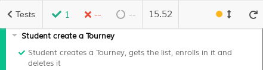

# ES20 P3 submission, Group NN

## Feature PPA

### Subgroup

 - Nome, istID, githubID
   + Issues assigned: [#1](https://github.com), [#3](https://github.com)
 - Nome, istID, githubID
   + Issues assigned: [#2](https://github.com), [#4](https://github.com)
 
### Pull requests associated with this feature

The list of pull requests associated with this feature is:

 - [PR #000](https://github.com)
 - [PR #001](https://github.com)
 - [PR #002](https://github.com)

### Frontend

#### New/Updated Views

 - [View0](https://github.com)
 - [View1](https://github.com)

#### New/Updated Models

 - [Model0](https://github.com)
 - [Model1](https://github.com)

### Additional services implemented

 - [Service 0](https://github.com)
    + [Controller](https://github.com)
    + [Spock tests](https://github.com)
    + [Feature test (JMeter)](https://github.com)

 - [Service 1](https://github.com)
    + [Controller](https://github.com)
    + [Spock tests](https://github.com)
    + [Feature test (JMeter)](https://github.com)

### End-to-end tests

#### Created tests

 - [Login creates and deletes a course execution](https://github.com/socialsoftware/quizzes-tutor/blob/6dcf668498be3d6e45c84ebf61e81b931bdc797b/frontend/tests/e2e/specs/admin/manageCourseExecutions.js#L10)
 - [Login creates two course executions and deletes it](https://github.com/socialsoftware/quizzes-tutor/blob/6dcf668498be3d6e45c84ebf61e81b931bdc797b/frontend/tests/e2e/specs/admin/manageCourseExecutions.js#L16)
 - [Login creates FROM a course execution and deletes it](https://github.com/socialsoftware/quizzes-tutor/blob/6dcf668498be3d6e45c84ebf61e81b931bdc797b/frontend/tests/e2e/specs/admin/manageCourseExecutions.js#L30)

#### Rationale
*TODO*: describe in 100 words (max) the relevance of the end-to-end tests defined with respect to the
common use cases.

#### Commands defined

 - [commands.js](https://github.com/socialsoftware/quizzes-tutor/blob/master/frontend/tests/e2e/support/commands.js)

#### Screenshot of test results overview

---

## Feature DDP

### Subgroup

 - Nome, istID, githubID
   + Issues assigned: [#1](https://github.com), [#3](https://github.com)
 - Nome, istID, githubID
   + Issues assigned: [#2](https://github.com), [#4](https://github.com)
 
### Pull requests associated with this feature

The list of pull requests associated with this feature is:

 - [PR #000](https://github.com)
 - [PR #001](https://github.com)
 - [PR #002](https://github.com)

### Frontend

#### New/Updated Views

 - [View0](https://github.com)
 - [View1](https://github.com)

#### New/Updated Models

 - [Model0](https://github.com)
 - [Model1](https://github.com)

### Additional services implemented

 - [Service 0](https://github.com)
    + [Controller](https://github.com)
    + [Spock tests](https://github.com)
    + [Feature test (JMeter)](https://github.com)

 - [Service 1](https://github.com)
    + [Controller](https://github.com)
    + [Spock tests](https://github.com)
    + [Feature test (JMeter)](https://github.com)

### End-to-end tests

#### Created tests

 - [Login creates and deletes a course execution](https://github.com/socialsoftware/quizzes-tutor/blob/6dcf668498be3d6e45c84ebf61e81b931bdc797b/frontend/tests/e2e/specs/admin/manageCourseExecutions.js#L10)
 - [Login creates two course executions and deletes it](https://github.com/socialsoftware/quizzes-tutor/blob/6dcf668498be3d6e45c84ebf61e81b931bdc797b/frontend/tests/e2e/specs/admin/manageCourseExecutions.js#L16)
 - [Login creates FROM a course execution and deletes it](https://github.com/socialsoftware/quizzes-tutor/blob/6dcf668498be3d6e45c84ebf61e81b931bdc797b/frontend/tests/e2e/specs/admin/manageCourseExecutions.js#L30)

#### Rationale
*TODO*: describe in 100 words (max) the relevance of the end-to-end tests defined with respect to the
common use cases.

#### Commands defined

 - [commands.js](https://github.com/socialsoftware/quizzes-tutor/blob/master/frontend/tests/e2e/support/commands.js)

#### Screenshot of test results overview

---

## Feature TDP

### Subgroup

 - Francisco Lopes, ist188078, Aegiel
   + Issues assigned: [#143](https://github.com/tecnico-softeng/es20tg_33-project/issues/143), [#144](https://github.com/tecnico-softeng/es20tg_33-project/issues/144), [#145](https://github.com/tecnico-softeng/es20tg_33-project/issues/145), [#146](https://github.com/tecnico-softeng/es20tg_33-project/issues/146), [#147](https://github.com/tecnico-softeng/es20tg_33-project/issues/147), [#149](https://github.com/tecnico-softeng/es20tg_33-project/issues/149), [#150](https://github.com/tecnico-softeng/es20tg_33-project/issues/150), [#151](https://github.com/tecnico-softeng/es20tg_33-project/issues/151)
 - Manuel Goulão, ist191049, mgoulao
   + Issues assigned: [#104](https://github.com/tecnico-softeng/es20tg_33-project/issues/104), [#105](https://github.com/tecnico-softeng/es20tg_33-project/issues/105), [#119](https://github.com/tecnico-softeng/es20tg_33-project/issues/119), [#117](https://github.com/tecnico-softeng/es20tg_33-project/issues/117), [#118](https://github.com/tecnico-softeng/es20tg_33-project/issues/118), [#124](https://github.com/tecnico-softeng/es20tg_33-project/issues/124), [#128](https://github.com/tecnico-softeng/es20tg_33-project/issues/128), [#130](https://github.com/tecnico-softeng/es20tg_33-project/issues/130)
 
### Pull requests associated with this feature

The list of pull requests associated with this feature is:

 - [PR #123](https://github.com/tecnico-softeng/es20tg_33-project/pull/123)
 - [PR #124](https://github.com/tecnico-softeng/es20tg_33-project/pull/124)
 - [PR #148](https://github.com/tecnico-softeng/es20tg_33-project/pull/148)
 - [PR #152](https://github.com/tecnico-softeng/es20tg_33-project/pull/152) 

### Frontend

#### New/Updated Views

 - [CreateTourney](https://github.com/tecnico-softeng/es20tg_33-project/blob/develop/frontend/src/views/student/tourney/CreateTourney.vue)
 - [OpenTourneys](https://github.com/tecnico-softeng/es20tg_33-project/blob/develop/frontend/src/views/student/tourney/OpenTourneys.vue)
 - [EnrollInTourney] and [CancelTourney] are both part of [OpenTourneys](https://github.com/tecnico-softeng/es20tg_33-project/blob/develop/frontend/src/views/student/tourney/OpenTourneys.vue)

#### New/Updated Models

 - [Tourney](https://github.com/tecnico-softeng/es20tg_33-project/blob/develop/backend/src/main/java/pt/ulisboa/tecnico/socialsoftware/tutor/tourney/Tourney.java)

### Additional services implemented

 - [Service 0](https://github.com)
    + [Controller](https://github.com)
    + [Spock tests](https://github.com)
    + [Feature test (JMeter)](https://github.com)

### End-to-end tests

#### Created tests

 - [Student creates a Tourney, gets the list, enrolls in it and deletes it](https://github.com/tecnico-softeng/es20tg_33-project/blob/6b608d3e511108312bc4e8630ebac551a8ae2d15/frontend/cypress/integration/student/tourneys.js#L16)

#### Rationale
The end-to-end tests ensure us that the tested features work as expected and fail when they are supposed to, since they test and validate all the layers of the application. They also test the application across various endpoints. which increases the confidence in it. And they also end up reducing testing cost and time if they are done by a testing tool like Cypress.

#### Commands defined

 - [commands.js](https://github.com/tecnico-softeng/es20tg_33-project/blob/TdP/frontend/cypress/support/commands.js)

#### Screenshot of test results overview

