# ES20 P4 submission, Group 33

## Feature PPA

### Subgroup

 - João Martins, ist190616, nodoak33
   + Issues assigned: [#167](https://github.com/tecnico-softeng/es20tg_33-project/issues/167), [#168](https://github.com/tecnico-softeng/es20tg_33-project/issues/168), [#170](https://github.com/tecnico-softeng/es20tg_33-project/issues/170), [#171](https://github.com/tecnico-softeng/es20tg_33-project/issues/171), [#176](https://github.com/tecnico-softeng/es20tg_33-project/issues/176), [#194](https://github.com/tecnico-softeng/es20tg_33-project/issues/194), [#196](https://github.com/tecnico-softeng/es20tg_33-project/issues/196), [#197](https://github.com/tecnico-softeng/es20tg_33-project/issues/197), [#208](https://github.com/tecnico-softeng/es20tg_33-project/issues/208)
   + Tasks: F6:Complete Functionality, F7:Complete Functionality, F8:Complete Functionality
 - Xavier Gomes, ist190637, xaviergomes99
   + Issues assigned: [#102](https://github.com/tecnico-softeng/es20tg_33-project/issues/102), [#165](https://github.com/tecnico-softeng/es20tg_33-project/issues/165), [#169](https://github.com/tecnico-softeng/es20tg_33-project/issues/169), [#173](https://github.com/tecnico-softeng/es20tg_33-project/issues/173), [#187](https://github.com/tecnico-softeng/es20tg_33-project/issues/187), [#188](https://github.com/tecnico-softeng/es20tg_33-project/issues/188), [#199](https://github.com/tecnico-softeng/es20tg_33-project/issues/199), [#200](https://github.com/tecnico-softeng/es20tg_33-project/issues/200)
   + Tasks: F4:Complete Functionality, F5:Complete Functionality
 
### Pull requests associated with this feature

The list of pull requests associated with this feature is:

 - [PR #211](https://github.com/tecnico-softeng/es20tg_33-project/pull/211)

### Listed features

Below, we list **only** the implemented features. For each feature, we link the relevant files and we mark which are requested parts are completed.

#### Feature number 1: (PpA:F4)_An approved question may become part of the set of available questions_

 - [x] [Service](https://github.com/tecnico-softeng/es20tg_33-project/blob/1c1180e2dff0f0b14651876c97807228722c15e3/backend/src/main/java/pt/ulisboa/tecnico/socialsoftware/tutor/studentQuestion/StudentQuestionService.java#L166)
 - [x] [Spock tests](https://github.com/tecnico-softeng/es20tg_33-project/blob/develop/backend/src/test/groovy/pt/ulisboa/tecnico/socialsoftware/tutor/studentQuestion/service/MakeAvailableTest.groovy)
 - [x] [JMeter feature tests](https://github.com/tecnico-softeng/es20tg_33-project/blob/develop/backend/jmeter/question/WSMakeAvailableTest.jmx)
   + Screenshots:
      
      ###### Test Results
     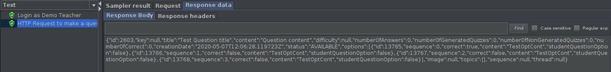
     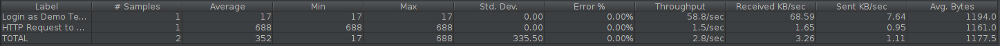
     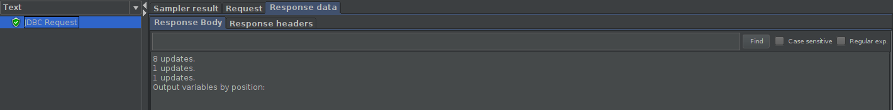
     
     ###### Load Test Results
     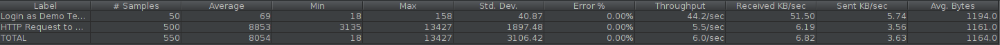
     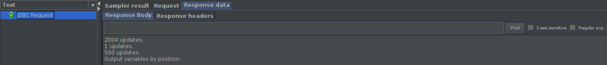
     
 - [x] [Cypress use case test](https://github.com/tecnico-softeng/es20tg_33-project/blob/develop/frontend/tests/e2e/specs/teacher/MakeQuestionAvailable.js)
   + Screenshot: 
   
     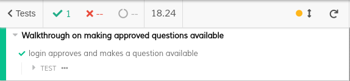
     
#### Feature number 2: (PpA:F5)_A teacher can change an approved question before placing it as part of the set of available questions_

 - [x] [Service](https://github.com/tecnico-softeng/es20tg_33-project/blob/1c1180e2dff0f0b14651876c97807228722c15e3/backend/src/main/java/pt/ulisboa/tecnico/socialsoftware/tutor/studentQuestion/StudentQuestionService.java#L191)
 - [x] [Spock tests](https://github.com/tecnico-softeng/es20tg_33-project/blob/develop/backend/src/test/groovy/pt/ulisboa/tecnico/socialsoftware/tutor/studentQuestion/service/EditApprovedQuestionTest.groovy)
 - [x] [JMeter feature tests](https://github.com/tecnico-softeng/es20tg_33-project/blob/develop/backend/jmeter/question/WSEditApprovedQuestionTest.jmx)
   + Screenshots:
      
      ###### Test Results
     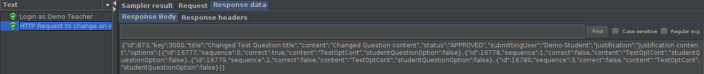
     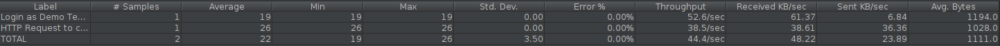
     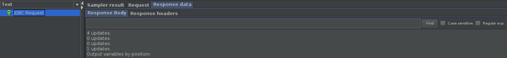
     
     ###### Load Test Results
     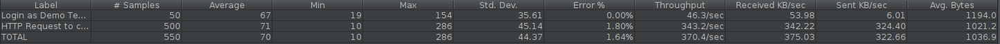
     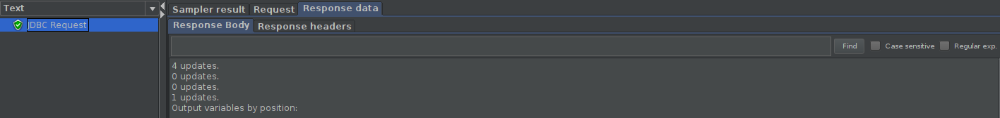
     
 - [x] [Cypress use case test](https://github.com/tecnico-softeng/es20tg_33-project/blob/develop/frontend/tests/e2e/specs/teacher/EditApprovedQuestion.js)
   + Screenshot: 
   
     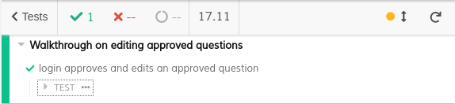
     
#### Feature number 3: (PpA:F6)_A rejected question can be changed and resubmitted by the student_

 - [x] [Service](https://github.com/tecnico-softeng/es20tg_33-project/blob/1c1180e2dff0f0b14651876c97807228722c15e3/backend/src/main/java/pt/ulisboa/tecnico/socialsoftware/tutor/studentQuestion/StudentQuestionService.java#L179)
 - [x] [Spock tests](https://github.com/tecnico-softeng/es20tg_33-project/blob/develop/backend/src/test/groovy/pt/ulisboa/tecnico/socialsoftware/tutor/studentQuestion/service/ResubmissionOfRejectedQuestion.groovy)
 - [x] [JMeter feature tests](https://github.com/tecnico-softeng/es20tg_33-project/blob/develop/backend/jmeter/question/WSResubmitQuestionTest.jmx)
   + Screenshots:
      
      ###### Test Results
     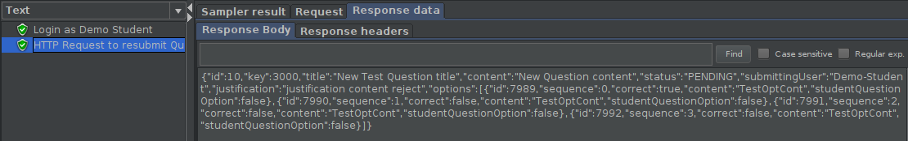
     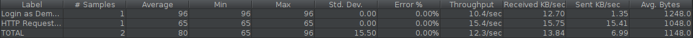
     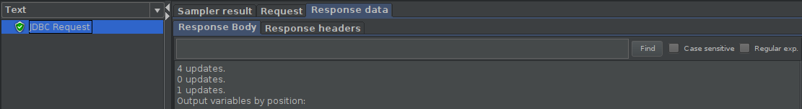
     
     ###### Load Test Results
     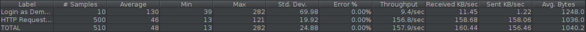
     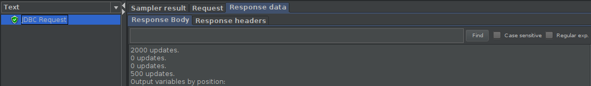
     
 - [x] [Cypress use case test](https://github.com/tecnico-softeng/es20tg_33-project/blob/develop/frontend/tests/e2e/specs/student/resubmitQuestion.js)
   + Screenshot: 
   
     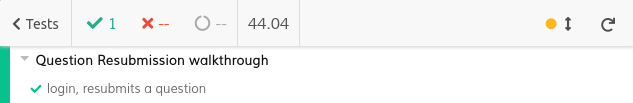
     
#### Feature number 4: (PpA:F7)_There is a student dashboard where information about the number of proposed/submitted and approved questions is presented_

 - [x] [Service](https://github.com/tecnico-softeng/es20tg_33-project/blob/1c1180e2dff0f0b14651876c97807228722c15e3/backend/src/main/java/pt/ulisboa/tecnico/socialsoftware/tutor/studentQuestion/StudentQuestionService.java#L202)
 - [x] [Spock tests](https://github.com/tecnico-softeng/es20tg_33-project/blob/develop/backend/src/test/groovy/pt/ulisboa/tecnico/socialsoftware/tutor/studentQuestion/service/DashboardStudentQuestionTest.groovy)
 - [x] [JMeter feature tests](https://github.com/tecnico-softeng/es20tg_33-project/blob/develop/backend/jmeter/question/WSStudentQuestionDashboardTest.jmx)
   + Screenshots:
      
      ###### Test Results
     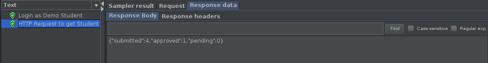
     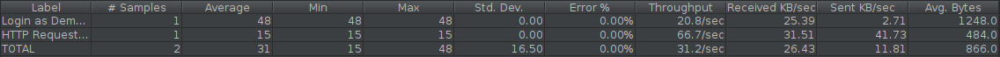
     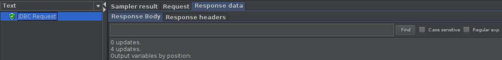

 - [x] [Cypress use case test](https://github.com/tecnico-softeng/es20tg_33-project/blob/develop/frontend/tests/e2e/specs/student/studentQuestionDashboard.js)
   + Screenshot: 
   
     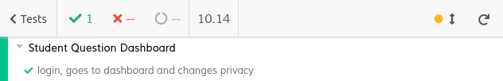
     
#### Feature number 5: (PpA:F8)_The student decides whether this information on his dashboard should be public or private_

 - [x] [Service](https://github.com/tecnico-softeng/es20tg_33-project/blob/1c1180e2dff0f0b14651876c97807228722c15e3/backend/src/main/java/pt/ulisboa/tecnico/socialsoftware/tutor/studentQuestion/StudentQuestionService.java#L224)
 - [x] [Spock tests](https://github.com/tecnico-softeng/es20tg_33-project/blob/develop/backend/src/test/groovy/pt/ulisboa/tecnico/socialsoftware/tutor/studentQuestion/service/StudentQuestionPrivacyTest.groovy)
 - [x] [JMeter feature tests](https://github.com/tecnico-softeng/es20tg_33-project/blob/develop/backend/jmeter/question/WSStudentQuestionDashboardPrivacyTest.jmx)
   + Screenshots:
      
      ###### Test Results
     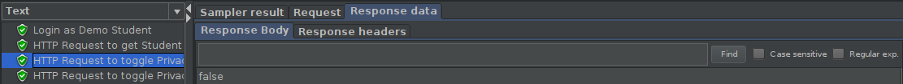
     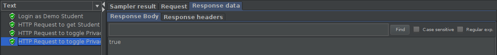
     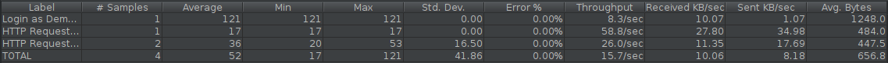
     
     
 - [x] [Cypress use case test](https://github.com/tecnico-softeng/es20tg_33-project/blob/develop/frontend/tests/e2e/specs/student/studentQuestionDashboard.js)
   + Screenshot: 
   
     
     

### Additional features

No additional features appart from the ones requested were implemented.

---

## Feature DDP

### Subgroup

 - Rodrigo Costa, 87702, rcosta1997
   + Issues assigned: [#180](https://github.com/tecnico-softeng/es20tg_33-project/issues/180), [#181](https://github.com/tecnico-softeng/es20tg_33-project/issues/181), [#184](https://github.com/tecnico-softeng/es20tg_33-project/issues/184), [#185](https://github.com/tecnico-softeng/es20tg_33-project/issues/185), [#193](https://github.com/tecnico-softeng/es20tg_33-project/issues/193), [#198](https://github.com/tecnico-softeng/es20tg_33-project/issues/198)
   + Tasks: F4.1: JMeter Test, F4.1:Cypress Test, F5.1: JMeter Test, F5.1:Cypress Test, F6.1: JMeter Test, F6.1:Cypress Test
 - Ricardo Caetano, 87699, OcarinaRedcoat
   + Issues assigned: [#177](https://github.com/tecnico-softeng/es20tg_33-project/issues/177), [#178](https://github.com/tecnico-softeng/es20tg_33-project/issues/178), [#179](https://github.com/tecnico-softeng/es20tg_33-project/issues/179),[#183](https://github.com/tecnico-softeng/es20tg_33-project/issues/183), [#192](https://github.com/tecnico-softeng/es20tg_33-project/issues/192),  [#189](https://github.com/tecnico-softeng/es20tg_33-project/issues/189), [#190](https://github.com/tecnico-softeng/es20tg_33-project/issues/190), [#191](https://github.com/tecnico-softeng/es20tg_33-project/issues/191), [#201](https://github.com/tecnico-softeng/es20tg_33-project/issues/201), [#202](https://github.com/tecnico-softeng/es20tg_33-project/issues/202)
   + Tasks: F4.1: Implement service, F4.1:Spock Tests, F5.1: Implement service, F5.1:Spock Tests, F6.1: Implement service, F6.1:Spock Tests, F7.1: Implement service, F7.1:Spock Tests, F7.1: Implement service, F7.1:Spock Tests, F8.1: Implement service, F8.1:Spock Tests
 
### Pull requests associated with this feature

The list of pull requests associated with this feature is:

 - [PR #000](https://github.com)

### Listed features

Below, we list **only** the implemented features. For each feature, we link the relevant files and we mark which are requested parts are completed.

#### Feature number 4.1: O aluno pode pedir esclarecimentos adicionais

 - [x] [Service](https://github.com/tecnico-softeng/es20tg_33-project/blob/e2a889c90346df06f801b1d0664dac6d586ced02/backend/src/main/java/pt/ulisboa/tecnico/socialsoftware/tutor/answer/api/DiscussionController.java#L46)
 - [x] [Spock tests](https://github.com/tecnico-softeng/es20tg_33-project/blob/e2a889c90346df06f801b1d0664dac6d586ced02/backend/src/test/groovy/pt/ulisboa/tecnico/socialsoftware/tutor/answer/service/RequestAdditionalClarification.groovy#L216)
 - [x] [JMeter feature tests](https://github.com)
   + Screenshots:
   
      ##### Test Results
     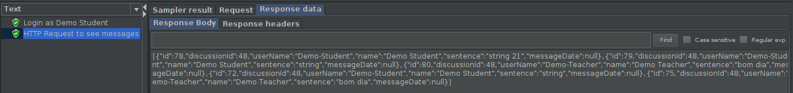
     
 - [x] [Cypress use case test](https://github.com)
   + Screenshot: 
   
     

#### Feature number 5.1: O docente pode tornar a questão e o seu esclarecimento disponível para os outros alunos

 - [x] [Service](https://github.com/tecnico-softeng/es20tg_33-project/blob/e2a889c90346df06f801b1d0664dac6d586ced02/backend/src/main/java/pt/ulisboa/tecnico/socialsoftware/tutor/answer/api/DiscussionController.java#L64)
 - [x] [Spock tests](https://github.com/tecnico-softeng/es20tg_33-project/blob/e2a889c90346df06f801b1d0664dac6d586ced02/backend/src/test/groovy/pt/ulisboa/tecnico/socialsoftware/tutor/answer/service/MakesClarificationPublic.groovy#L165
 - [x] [JMeter feature test](https://github.com)
    + Screenshots:
   
      ##### Test Results
     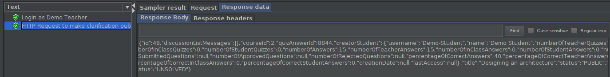
     
 - [x] [Cypress use case test](https://github.com)
   + Screenshot: 
   
     

#### Feature number 6.1: Um aluno, após responder a uma pergunta, pode consultar, se existirem, os pedidos de esclarecimento sobre essa pergunta e as respostas dadas

 - [x] [Service](https://github.com/tecnico-softeng/es20tg_33-project/blob/e2a889c90346df06f801b1d0664dac6d586ced02/backend/src/main/java/pt/ulisboa/tecnico/socialsoftware/tutor/answer/api/DiscussionController.java#L70)
 - [x] [Spock tests](https://github.com/tecnico-softeng/es20tg_33-project/blob/e2a889c90346df06f801b1d0664dac6d586ced02/backend/src/test/groovy/pt/ulisboa/tecnico/socialsoftware/tutor/answer/service/ConsultOtherDiscussionsTest.groovy#L164)
 - [x] [JMeter feature test](https://github.com)
     + Screenshots:
   
      ##### Test Results
     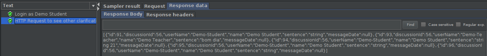
     
 - [x] [Cypress use case test](https://github.com)
   + Screenshot: 
   
     
     
#### Feature number 7.1: Dashboard do aluno

 - [x] [Service](https://github.com/tecnico-softeng/es20tg_33-project/blob/e2a889c90346df06f801b1d0664dac6d586ced02/backend/src/main/java/pt/ulisboa/tecnico/socialsoftware/tutor/answer/api/DiscussionController.java#L82)
 - [x] [Spock tests](https://github.com/tecnico-softeng/es20tg_33-project/blob/e2a889c90346df06f801b1d0664dac6d586ced02/backend/src/test/groovy/pt/ulisboa/tecnico/socialsoftware/tutor/answer/service/DiscussionDashboardTest.groovy#L166)

#### Feature number 8.1: O aluno decide se esta informação no seu dashboard deve ser pública ou privada

 - [x] [Service](https://github.com/tecnico-softeng/es20tg_33-project/blob/e2a889c90346df06f801b1d0664dac6d586ced02/backend/src/main/java/pt/ulisboa/tecnico/socialsoftware/tutor/answer/api/DiscussionController.java#L88)
 - [x] [Spock tests](https://github.com/tecnico-softeng/es20tg_33-project/blob/e2a889c90346df06f801b1d0664dac6d586ced02/backend/src/test/groovy/pt/ulisboa/tecnico/socialsoftware/tutor/answer/service/MakeDashboardPublicTest.groovy#L166)

### Additional features

**TODO**: if you have implemented additional features, describe them here (following the same format as above).

---

## Feature TDP

### Subgroup
 - Francisco Lopes, ist188078, Aegiel
   + Issues assigned: [#175](https://github.com/tecnico-softeng/es20tg_33-project/issues/175), [#203](https://github.com/tecnico-softeng/es20tg_33-project/issues/203), [#206](https://github.com/tecnico-softeng/es20tg_33-project/issues/206), [#207](https://github.com/tecnico-softeng/es20tg_33-project/issues/207), [#213](https://github.com/tecnico-softeng/es20tg_33-project/issues/213), [#214](https://github.com/tecnico-softeng/es20tg_33-project/issues/214)
   + Tasks: F6:Complete Functionality
            F8:Complete Functionality
 - Manuel Goulão, ist191049, mgoulao
   + Issues assigned: [#186](https://github.com/tecnico-softeng/es20tg_33-project/issues/186), [#204](https://github.com/tecnico-softeng/es20tg_33-project/issues/204)
   + Tasks: F7:Complete Functionality
 
### Pull requests associated with this feature

The list of pull requests associated with this feature is:

 - [PR #205](https://github.com/tecnico-softeng/es20tg_33-project/pull/205)
 - [PR #215](https://github.com/tecnico-softeng/es20tg_33-project/pull/215)

### Listed features

Below, we list **only** the implemented features. For each feature, we link the relevant files and we mark which are requested parts are completed.

#### Feature number 6.1: _The participating students answer the questions in the defined period of time for the tourney_
 - [x] [Service](https://github.com/tecnico-softeng/es20tg_33-project/blob/1c1180e2dff0f0b14651876c97807228722c15e3/backend/src/main/java/pt/ulisboa/tecnico/socialsoftware/tutor/tourney/TourneyService.java#L277)
 - [x] [Spock tests](https://github.com/tecnico-softeng/es20tg_33-project/blob/3e94bfe399c9d17fcb8111049eaa60e70b678229/backend/src/test/groovy/pt/ulisboa/tecnico/socialsoftware/tutor/tourney/service/StudentEnrolsIntoTourneyTest.groovy#L234)
 - [x] [JMeter feature tests](https://github.com/tecnico-softeng/es20tg_33-project/blob/TdP/backend/jmeter/tourney/WSGetTourneyQuizAnswerTest.jmx)
   + Screenshots:
   
      ##### Test Results
     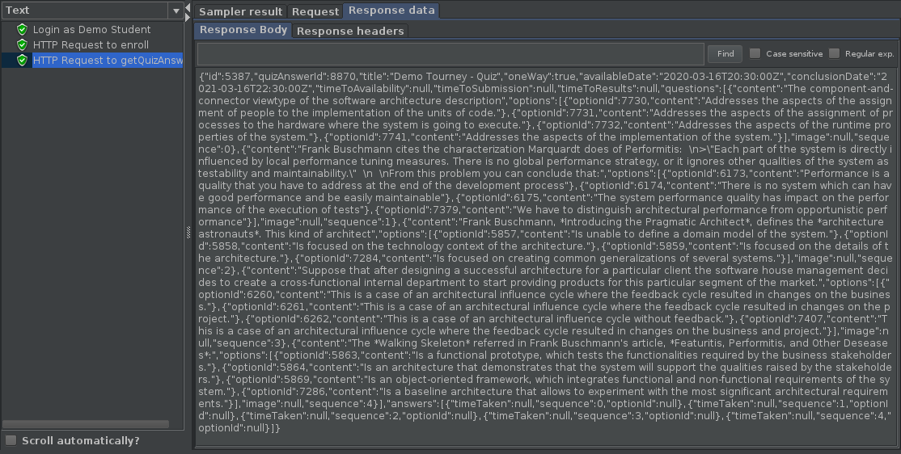
     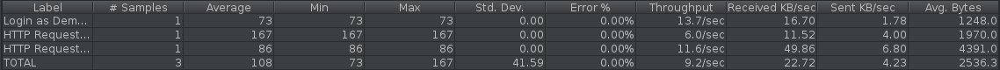
     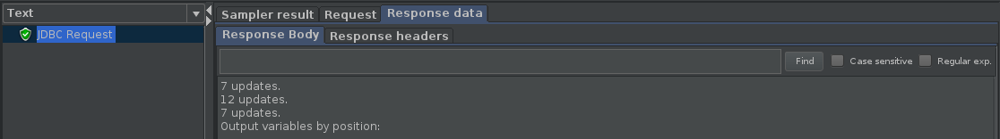
     
 - [x] [Cypress use case test](https://github.com/tecnico-softeng/es20tg_33-project/blob/3e94bfe399c9d17fcb8111049eaa60e70b678229/frontend/tests/e2e/specs/student/tourneys.js#L47)
   + Screenshot: 
   
     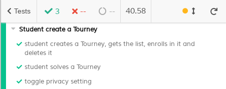

#### Feature number 7.1: _The Dashboard gives student information about Tourneys in which he participated with the score for each Tourney_
 - [x] [Service](https://github.com/tecnico-softeng/es20tg_33-project/blob/1c1180e2dff0f0b14651876c97807228722c15e3/backend/src/main/java/pt/ulisboa/tecnico/socialsoftware/tutor/tourney/TourneyService.java#L249)
 - [x] [JMeter feature tests](https://github.com/tecnico-softeng/es20tg_33-project/blob/TdP/backend/jmeter/tourney/WSGetTourneyDashboardTest.jmx)
   + Screenshots:
   
      ##### Test Results
     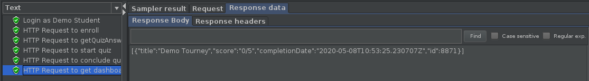
     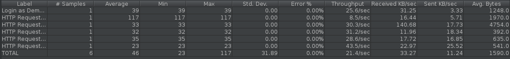
     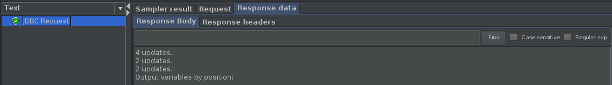
     
 - [x] [Cypress use case test](https://github.com/tecnico-softeng/es20tg_33-project/blob/3e94bfe399c9d17fcb8111049eaa60e70b678229/frontend/tests/e2e/specs/student/tourneys.js#L47)
   + Screenshot: 
    
     
 

#### Feature number 8.1: _The student decides if the information in their dashboard should be public or private_
 - [x] [Service](https://github.com/tecnico-softeng/es20tg_33-project/blob/76a86c87f99e1eb8b6c6430b1a2e0b8496e1ffbf/backend/src/main/java/pt/ulisboa/tecnico/socialsoftware/tutor/tourney/TourneyService.java#L304)
 - [x] [Spock tests](https://github.com/tecnico-softeng/es20tg_33-project/blob/TdP/backend/src/test/groovy/pt/ulisboa/tecnico/socialsoftware/tutor/tourney/service/ToggleTourneyPrivacyTest.groovy)
 - [x] [JMeter feature tests](https://github.com/tecnico-softeng/es20tg_33-project/blob/TdP/backend/jmeter/tourney/WSToggleTourneyPrivacyTest.jmx)
   + Screenshots:
   
      ##### Test Results
     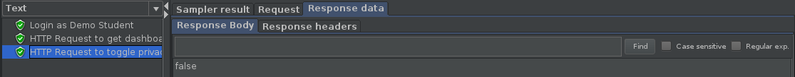
     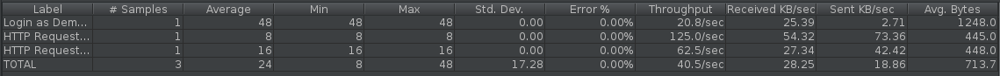
     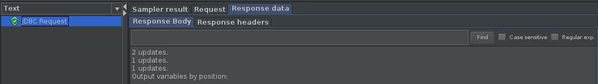
     
 - [x] [Cypress use case test](https://github.com/tecnico-softeng/es20tg_33-project/blob/3e94bfe399c9d17fcb8111049eaa60e70b678229/frontend/tests/e2e/specs/student/tourneys.js#L80)
   + Screenshot: 
    
     
     
     
### Additional features

No additional features, apart from the ones requested, were implemented.

---
